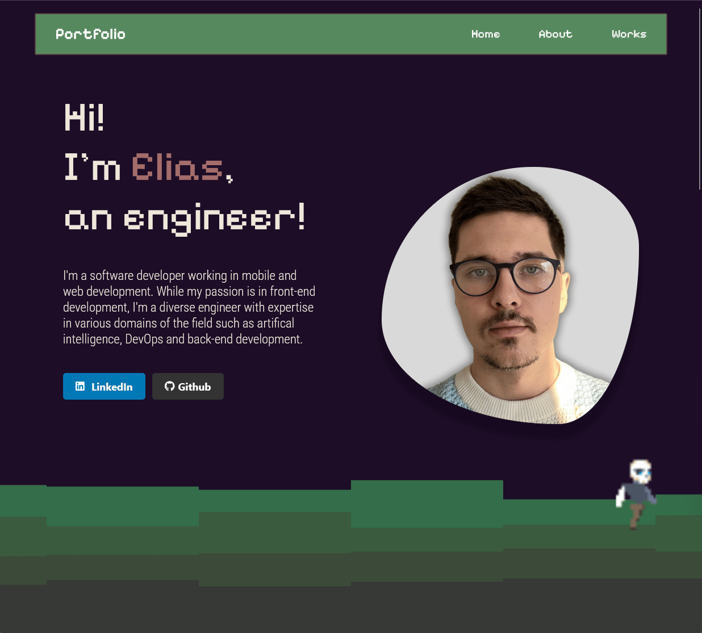

# Portfolio

Portfolio created with:
*  React
*  JavaScript
*  CSS
*  Visual Studio Code
* Deployed with Vercel


## Getting started

You need to have ```node.js``` installed.

1. Installation: ```npm install```
2. Run: ```npm start```
3. Open http://localhost:3000 in the browser.

## Why do you need a portfolio?

* You can tell about yourself and the skills you have
* To showcase your projects
* Broader than CV


